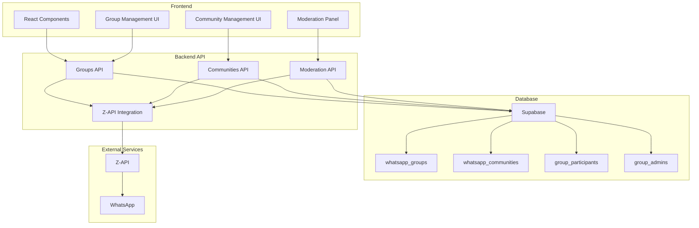

# Design: Sistema de Grupos WhatsApp - Implementação Completa

## Visão Geral

Este documento descreve o design arquitetural para implementar um sistema completo de gerenciamento de grupos WhatsApp, alinhado com todas as funcionalidades disponíveis na Z-API.

## Arquitetura

### Arquitetura Geral



### Estrutura de Dados

#### Tabela: whatsapp_groups (Atualizada)
```sql
CREATE TABLE whatsapp_groups (
  id UUID PRIMARY KEY DEFAULT gen_random_uuid(),
  name VARCHAR(255) NOT NULL,
  whatsapp_id VARCHAR(255) UNIQUE,
  description TEXT,
  image_url TEXT,
  invite_link TEXT,
  invite_link_expires_at TIMESTAMP,
  max_participants INTEGER DEFAULT 256,
  is_community_group BOOLEAN DEFAULT FALSE,
  community_id UUID REFERENCES whatsapp_communities(id),
  settings JSONB DEFAULT '{}',
  user_id UUID NOT NULL REFERENCES auth.users(id),
  created_at TIMESTAMP DEFAULT NOW(),
  updated_at TIMESTAMP DEFAULT NOW()
);
```

#### Tabela: whatsapp_communities (Nova)
```sql
CREATE TABLE whatsapp_communities (
  id UUID PRIMARY KEY DEFAULT gen_random_uuid(),
  name VARCHAR(255) NOT NULL,
  description TEXT,
  whatsapp_id VARCHAR(255) UNIQUE,
  announcement_group_id UUID REFERENCES whatsapp_groups(id),
  max_groups INTEGER DEFAULT 50,
  settings JSONB DEFAULT '{}',
  user_id UUID NOT NULL REFERENCES auth.users(id),
  created_at TIMESTAMP DEFAULT NOW(),
  updated_at TIMESTAMP DEFAULT NOW()
);
```

#### Tabela: group_participants (Nova)
```sql
CREATE TABLE group_participants (
  id UUID PRIMARY KEY DEFAULT gen_random_uuid(),
  group_id UUID NOT NULL REFERENCES whatsapp_groups(id) ON DELETE CASCADE,
  phone VARCHAR(20) NOT NULL,
  name VARCHAR(255),
  is_admin BOOLEAN DEFAULT FALSE,
  is_creator BOOLEAN DEFAULT FALSE,
  joined_at TIMESTAMP DEFAULT NOW(),
  left_at TIMESTAMP,
  status VARCHAR(20) DEFAULT 'active', -- active, pending, banned
  UNIQUE(group_id, phone)
);
```

#### Tabela: group_invites (Nova)
```sql
CREATE TABLE group_invites (
  id UUID PRIMARY KEY DEFAULT gen_random_uuid(),
  group_id UUID NOT NULL REFERENCES whatsapp_groups(id) ON DELETE CASCADE,
  invite_link TEXT UNIQUE,
  expires_at TIMESTAMP,
  max_uses INTEGER,
  used_count INTEGER DEFAULT 0,
  created_by UUID NOT NULL REFERENCES auth.users(id),
  created_at TIMESTAMP DEFAULT NOW()
);
```

#### Tabela: group_messages (Nova)
```sql
CREATE TABLE group_messages (
  id UUID PRIMARY KEY DEFAULT gen_random_uuid(),
  group_id UUID NOT NULL REFERENCES whatsapp_groups(id) ON DELETE CASCADE,
  sender_phone VARCHAR(20) NOT NULL,
  content TEXT NOT NULL,
  message_type VARCHAR(20) DEFAULT 'text', -- text, image, document, audio, poll
  whatsapp_message_id VARCHAR(255),
  reply_to_message_id UUID REFERENCES group_messages(id),
  is_announcement BOOLEAN DEFAULT FALSE,
  is_deleted BOOLEAN DEFAULT FALSE,
  deleted_by UUID REFERENCES auth.users(id),
  deleted_at TIMESTAMP,
  created_at TIMESTAMP DEFAULT NOW()
);
```

#### Tabela: message_reactions (Nova)
```sql
CREATE TABLE message_reactions (
  id UUID PRIMARY KEY DEFAULT gen_random_uuid(),
  message_id UUID NOT NULL REFERENCES group_messages(id) ON DELETE CASCADE,
  user_phone VARCHAR(20) NOT NULL,
  emoji VARCHAR(10) NOT NULL,
  created_at TIMESTAMP DEFAULT NOW(),
  UNIQUE(message_id, user_phone)
);
```

#### Tabela: group_polls (Nova)
```sql
CREATE TABLE group_polls (
  id UUID PRIMARY KEY DEFAULT gen_random_uuid(),
  group_id UUID NOT NULL REFERENCES whatsapp_groups(id) ON DELETE CASCADE,
  question TEXT NOT NULL,
  options JSONB NOT NULL, -- Array of options
  allow_multiple BOOLEAN DEFAULT FALSE,
  expires_at TIMESTAMP,
  created_by UUID NOT NULL REFERENCES auth.users(id),
  created_at TIMESTAMP DEFAULT NOW()
);
```

#### Tabela: poll_votes (Nova)
```sql
CREATE TABLE poll_votes (
  id UUID PRIMARY KEY DEFAULT gen_random_uuid(),
  poll_id UUID NOT NULL REFERENCES group_polls(id) ON DELETE CASCADE,
  user_phone VARCHAR(20) NOT NULL,
  selected_options JSONB NOT NULL, -- Array of selected option indices
  created_at TIMESTAMP DEFAULT NOW(),
  UNIQUE(poll_id, user_phone)
);
```

## Componentes e Interfaces

### Frontend Components

#### Group Management Components
```typescript
// GroupForm.tsx - Formulário para criar/editar grupos
interface GroupFormProps {
  group?: Group;
  onSubmit: (data: GroupFormData) => Promise<void>;
  onCancel: () => void;
}

// GroupList.tsx - Lista de grupos com busca e filtros
interface GroupListProps {
  groups: Group[];
  onGroupSelect: (group: Group) => void;
  onGroupEdit: (group: Group) => void;
  onGroupDelete: (group: Group) => void;
}

// ParticipantManager.tsx - Gerenciamento de participantes
interface ParticipantManagerProps {
  group: Group;
  participants: Participant[];
  onAddParticipant: (phone: string) => Promise<void>;
  onRemoveParticipant: (phone: string) => Promise<void>;
  onPromoteAdmin: (phone: string) => Promise<void>;
  onDemoteAdmin: (phone: string) => Promise<void>;
}

// GroupChat.tsx - Interface de chat do grupo
interface GroupChatProps {
  group: Group;
  messages: Message[];
  onSendMessage: (content: string, type: MessageType) => Promise<void>;
  onReactToMessage: (messageId: string, emoji: string) => Promise<void>;
  onDeleteMessage: (messageId: string) => Promise<void>;
}
```

#### Community Management Components
```typescript
// CommunityForm.tsx - Formulário para criar/editar comunidades
interface CommunityFormProps {
  community?: Community;
  onSubmit: (data: CommunityFormData) => Promise<void>;
  onCancel: () => void;
}

// CommunityGroups.tsx - Gerenciamento de grupos da comunidade
interface CommunityGroupsProps {
  community: Community;
  groups: Group[];
  onAddGroup: (group: Group) => Promise<void>;
  onRemoveGroup: (group: Group) => Promise<void>;
}

// AnnouncementGroup.tsx - Interface do grupo de avisos
interface AnnouncementGroupProps {
  community: Community;
  onSendAnnouncement: (content: string) => Promise<void>;
}
```

#### Moderation Components
```typescript
// ModerationPanel.tsx - Painel de moderação
interface ModerationPanelProps {
  group: Group;
  onDeleteMessage: (messageId: string) => Promise<void>;
  onBanUser: (phone: string) => Promise<void>;
  onUnbanUser: (phone: string) => Promise<void>;
}

// MessageActions.tsx - Ações em mensagens
interface MessageActionsProps {
  message: Message;
  userRole: 'admin' | 'member';
  onReact: (emoji: string) => Promise<void>;
  onReply: () => void;
  onDelete: () => Promise<void>;
  onReport: () => Promise<void>;
}
```

### Backend API Endpoints

#### Groups API
```typescript
// GET /api/groups - Listar grupos
interface ListGroupsResponse {
  groups: Group[];
  total: number;
  page: number;
  limit: number;
}

// GET /api/groups/search - Buscar grupos
interface SearchGroupsRequest {
  query: string;
  filters?: {
    name?: string;
    participants?: string[];
    description?: string;
  };
  page?: number;
  limit?: number;
}

// POST /api/groups - Criar grupo
interface CreateGroupRequest {
  name: string;
  description?: string;
  participants: string[];
  image?: File;
}

// PATCH /api/groups/[id]/name - Atualizar nome
interface UpdateGroupNameRequest {
  name: string;
}

// PATCH /api/groups/[id]/description - Atualizar descrição
interface UpdateGroupDescriptionRequest {
  description: string;
}

// PATCH /api/groups/[id]/image - Atualizar imagem
interface UpdateGroupImageRequest {
  image: File;
}

// POST /api/groups/[id]/participants - Adicionar participantes
interface AddParticipantsRequest {
  participants: string[];
}

// DELETE /api/groups/[id]/participants - Remover participantes
interface RemoveParticipantsRequest {
  participants: string[];
}

// POST /api/groups/[id]/admins - Promover administrador
interface PromoteAdminRequest {
  phone: string;
}

// DELETE /api/groups/[id]/admins - Remover administrador
interface DemoteAdminRequest {
  phone: string;
}

// GET /api/groups/[id]/invite-link - Obter link de convite
interface GetInviteLinkResponse {
  inviteLink: string;
  expiresAt: string;
  maxUses: number;
  usedCount: number;
}

// POST /api/groups/[id]/reset-invite-link - Redefinir link de convite
interface ResetInviteLinkRequest {
  expiresAt?: string;
  maxUses?: number;
}

// POST /api/groups/accept-invite - Aceitar convite
interface AcceptInviteRequest {
  inviteLink: string;
}
```

#### Communities API
```typescript
// GET /api/communities - Listar comunidades
interface ListCommunitiesResponse {
  communities: Community[];
  total: number;
}

// POST /api/communities - Criar comunidade
interface CreateCommunityRequest {
  name: string;
  description?: string;
}

// PUT /api/communities/[id] - Atualizar comunidade
interface UpdateCommunityRequest {
  name?: string;
  description?: string;
}

// DELETE /api/communities/[id] - Desativar comunidade
interface DeactivateCommunityResponse {
  success: boolean;
  message: string;
}

// POST /api/communities/[id]/groups - Vincular grupo
interface LinkGroupRequest {
  groupId: string;
}

// DELETE /api/communities/[id]/groups - Desvincular grupo
interface UnlinkGroupRequest {
  groupId: string;
}

// POST /api/communities/[id]/announcement - Enviar anúncio
interface SendAnnouncementRequest {
  content: string;
  type: 'text' | 'image' | 'document';
  file?: File;
}
```

#### Moderation API
```typescript
// DELETE /api/messages/[id] - Apagar mensagem
interface DeleteMessageResponse {
  success: boolean;
  message: string;
}

// POST /api/groups/[id]/ban - Banir usuário
interface BanUserRequest {
  phone: string;
  reason?: string;
}

// POST /api/groups/[id]/unban - Desbanir usuário
interface UnbanUserRequest {
  phone: string;
}
```

## Modelos de Dados

### Group Model
```typescript
interface Group {
  id: string;
  name: string;
  whatsapp_id: string;
  description?: string;
  image_url?: string;
  invite_link?: string;
  invite_link_expires_at?: string;
  max_participants: number;
  is_community_group: boolean;
  community_id?: string;
  settings: GroupSettings;
  user_id: string;
  created_at: string;
  updated_at: string;
  participants: Participant[];
  admins: Participant[];
}

interface GroupSettings {
  allow_member_invites: boolean;
  allow_member_messages: boolean;
  allow_member_media: boolean;
  allow_member_polls: boolean;
  require_admin_approval: boolean;
  mute_notifications: boolean;
}
```

### Community Model
```typescript
interface Community {
  id: string;
  name: string;
  description?: string;
  whatsapp_id: string;
  announcement_group_id: string;
  max_groups: number;
  settings: CommunitySettings;
  user_id: string;
  created_at: string;
  updated_at: string;
  groups: Group[];
  announcement_group: Group;
}

interface CommunitySettings {
  allow_group_creation: boolean;
  allow_member_invites: boolean;
  require_admin_approval: boolean;
  auto_approve_groups: boolean;
}
```

### Participant Model
```typescript
interface Participant {
  id: string;
  group_id: string;
  phone: string;
  name?: string;
  is_admin: boolean;
  is_creator: boolean;
  joined_at: string;
  left_at?: string;
  status: 'active' | 'pending' | 'banned';
}
```

### Message Model
```typescript
interface Message {
  id: string;
  group_id: string;
  sender_phone: string;
  content: string;
  message_type: 'text' | 'image' | 'document' | 'audio' | 'poll';
  whatsapp_message_id?: string;
  reply_to_message_id?: string;
  is_announcement: boolean;
  is_deleted: boolean;
  deleted_by?: string;
  deleted_at?: string;
  created_at: string;
  reactions: Reaction[];
  poll?: Poll;
}

interface Reaction {
  id: string;
  message_id: string;
  user_phone: string;
  emoji: string;
  created_at: string;
}

interface Poll {
  id: string;
  group_id: string;
  question: string;
  options: string[];
  allow_multiple: boolean;
  expires_at?: string;
  created_by: string;
  created_at: string;
  votes: PollVote[];
}

interface PollVote {
  id: string;
  poll_id: string;
  user_phone: string;
  selected_options: number[];
  created_at: string;
}
```

## Tratamento de Erros

### Error Handling Strategy
```typescript
interface APIError {
  code: string;
  message: string;
  details?: any;
  timestamp: string;
}

// Error Codes
enum ErrorCodes {
  GROUP_NOT_FOUND = 'GROUP_NOT_FOUND',
  PARTICIPANT_NOT_FOUND = 'PARTICIPANT_NOT_FOUND',
  INSUFFICIENT_PERMISSIONS = 'INSUFFICIENT_PERMISSIONS',
  GROUP_FULL = 'GROUP_FULL',
  INVITE_LINK_EXPIRED = 'INVITE_LINK_EXPIRED',
  Z_API_ERROR = 'Z_API_ERROR',
  VALIDATION_ERROR = 'VALIDATION_ERROR',
  RATE_LIMIT_EXCEEDED = 'RATE_LIMIT_EXCEEDED'
}
```

### Error Responses
```typescript
// 400 Bad Request
interface BadRequestResponse {
  error: {
    code: 'VALIDATION_ERROR';
    message: string;
    details: ValidationError[];
  };
}

// 403 Forbidden
interface ForbiddenResponse {
  error: {
    code: 'INSUFFICIENT_PERMISSIONS';
    message: string;
  };
}

// 404 Not Found
interface NotFoundResponse {
  error: {
    code: 'GROUP_NOT_FOUND';
    message: string;
  };
}

// 429 Too Many Requests
interface RateLimitResponse {
  error: {
    code: 'RATE_LIMIT_EXCEEDED';
    message: string;
    retryAfter: number;
  };
}
```

## Estratégia de Testes

### Testes Unitários
- Testes para todos os endpoints da API
- Testes para validações de dados
- Testes para lógica de negócio
- Testes para integração com Z-API

### Testes de Integração
- Testes de fluxo completo de criação de grupos
- Testes de sincronização com WhatsApp
- Testes de realtime updates
- Testes de performance

### Testes E2E
- Testes de interface de usuário
- Testes de fluxos de moderação
- Testes de funcionalidades de comunidade
- Testes de responsividade

## Considerações de Segurança

### Autenticação e Autorização
- Todas as operações requerem autenticação
- Verificação de permissões baseada em roles
- Validação de propriedade de grupos/comunidades
- Rate limiting para prevenir abuso

### Validação de Dados
- Sanitização de inputs
- Validação de tipos e formatos
- Verificação de limites (participantes, tamanho de arquivos)
- Prevenção de SQL injection

### Auditoria
- Logs de todas as operações críticas
- Rastreamento de mudanças de permissões
- Monitoramento de atividades suspeitas
- Retenção de logs por 1 ano

## Monitoramento e Observabilidade

### Métricas
- Número de grupos criados/atualizados
- Número de mensagens enviadas
- Tempo de resposta da API
- Taxa de erro por endpoint
- Uso de recursos (CPU, memória, banco)

### Alertas
- Taxa de erro > 5%
- Tempo de resposta > 5 segundos
- Falhas de sincronização com Z-API
- Uso de recursos > 80%
- Atividades suspeitas detectadas

### Logs
- Logs estruturados em JSON
- Níveis: DEBUG, INFO, WARN, ERROR
- Contexto: user_id, group_id, operation
- Correlação de requests com trace_id
