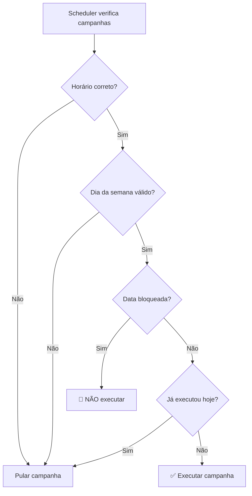

# 📅 Sistema de Calendário de Bloqueios

## 🎯 Visão Geral

O sistema de calendário permite **bloquear datas específicas** para que campanhas não executem automaticamente, mantendo-as ativas para outros dias.

## ✨ Funcionalidades

- ✅ **Bloqueio de datas individuais** ou períodos
- ✅ **Motivo do bloqueio** (opcional)
- ✅ **Interface visual** com calendário interativo
- ✅ **Lista de datas bloqueadas** com opção de remoção
- ✅ **Integração com scheduler** automático
- ✅ **Campanha permanece ativa** nos dias não bloqueados

## 🚀 Como Usar

### **1. Acessar o Calendário**
- Vá para **"Editar Campanha"**
- O calendário aparece no topo da página
- Selecione as datas que deseja bloquear

### **2. Bloquear Datas**
- **Data única**: Clique em uma data
- **Período**: Clique e arraste para selecionar múltiplas datas
- **Motivo**: Adicione um motivo (opcional)
- **Confirmar**: Clique em "Bloquear X data(s) selecionada(s)"

### **3. Gerenciar Bloqueios**
- **Visualizar**: Datas bloqueadas aparecem em vermelho
- **Remover**: Clique no ícone de lixeira para desbloquear
- **Lista**: Veja todas as datas bloqueadas com motivos

## 📊 Exemplo Prático

### **Cenário: Campanha de Segunda a Sexta**
```
Campanha: "Promoção Semanal"
Horário: 09:00 (todos os dias)
Bloqueios: Sábados e domingos
```

**Resultado:**
- ✅ **Segunda 09:00** → Executa automaticamente
- ✅ **Terça 09:00** → Executa automaticamente  
- ✅ **Quarta 09:00** → Executa automaticamente
- ✅ **Quinta 09:00** → Executa automaticamente
- ✅ **Sexta 09:00** → Executa automaticamente
- 🚫 **Sábado 09:00** → NÃO executa (bloqueado)
- 🚫 **Domingo 09:00** → NÃO executa (bloqueado)

### **Cenário: Bloqueio de Feriados**
```
Campanha: "Ofertas Diárias"
Horário: 14:00 (todos os dias)
Bloqueios: 25/12, 01/01, 15/11
```

**Resultado:**
- ✅ **Dias normais 14:00** → Executa automaticamente
- 🚫 **25/12 14:00** → NÃO executa (Natal)
- 🚫 **01/01 14:00** → NÃO executa (Ano Novo)
- 🚫 **15/11 14:00** → NÃO executa (Proclamação da República)

## 🔧 Estrutura Técnica

### **Tabela `campaign_blocked_dates`**
```sql
- id: UUID (chave primária)
- campaign_id: UUID (referência à campanha)
- blocked_date: DATE (data bloqueada)
- reason: TEXT (motivo do bloqueio)
- created_at: TIMESTAMP (data de criação)
```

### **APIs Disponíveis**
- `GET /api/campaigns/[id]/blocked-dates` - Listar datas bloqueadas
- `POST /api/campaigns/[id]/blocked-dates` - Bloquear datas
- `DELETE /api/campaigns/[id]/blocked-dates?date=YYYY-MM-DD` - Desbloquear data

### **Integração com Scheduler**
O scheduler verifica automaticamente:
1. **Horário correto** ✅
2. **Dia da semana válido** ✅
3. **Data não bloqueada** ✅ (NOVO)
4. **Não executada hoje** ✅

## 🎨 Interface Visual

### **Calendário**
- **Verde**: Datas normais (campanha executa)
- **Vermelho**: Datas bloqueadas (campanha não executa)
- **Seleção**: Clique e arraste para múltiplas datas

### **Lista de Bloqueios**
- **Data formatada**: "quinta-feira, 19 de setembro de 2025"
- **Motivo**: Exibido se fornecido
- **Ação**: Botão para remover bloqueio

## 🚨 Regras de Negócio

### **Bloqueios**
- ✅ **Múltiplas datas** podem ser bloqueadas de uma vez
- ✅ **Períodos** podem ser bloqueados (ex: 1 semana)
- ✅ **Motivos** são opcionais mas recomendados
- ✅ **Datas passadas** podem ser bloqueadas (para histórico)

### **Execução**
- 🚫 **Datas bloqueadas** nunca executam
- ✅ **Datas não bloqueadas** executam normalmente
- ✅ **Campanha permanece ativa** mesmo com bloqueios
- ✅ **Scheduler respeita** todos os bloqueios

## 📝 Casos de Uso Comuns

### **1. Fins de Semana**
```
Bloquear: Todos os sábados e domingos
Motivo: "Fins de semana"
```

### **2. Feriados Nacionais**
```
Bloquear: 01/01, 21/04, 01/05, 07/09, 12/10, 02/11, 15/11, 25/12
Motivo: "Feriados nacionais"
```

### **3. Manutenção**
```
Bloquear: 15/10 a 20/10
Motivo: "Manutenção do sistema"
```

### **4. Eventos Especiais**
```
Bloquear: 14/02
Motivo: "Dia dos Namorados - campanha especial"
```

## 🔄 Fluxo de Execução



## 🎯 Benefícios

- **Flexibilidade**: Controle total sobre quando executar
- **Automação**: Mantém execução automática nos dias permitidos
- **Visibilidade**: Interface clara para gerenciar bloqueios
- **Histórico**: Registro de motivos e datas bloqueadas
- **Simplicidade**: Fácil de usar e entender

O sistema de calendário torna o agendamento de campanhas muito mais flexível e profissional! 🚀
