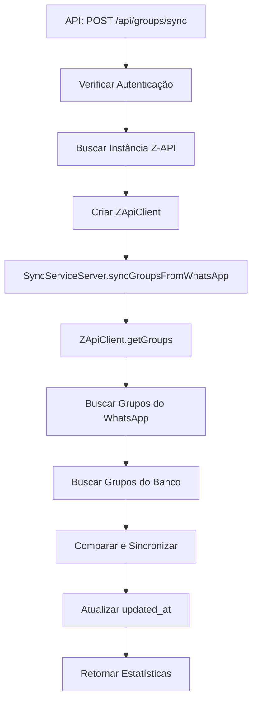

# Correção do Campo `is_active` Inexistente

## Problema Identificado

O erro 500 na API de sincronização estava ocorrendo porque o `SyncServiceServer` estava tentando usar o campo `is_active` na tabela `whatsapp_groups`, mas esse campo não existe na estrutura atual da tabela.

## Erro Específico

```sql
-- ❌ Erro: Campo is_active não existe na tabela whatsapp_groups
SELECT * FROM whatsapp_groups WHERE is_active = true
UPDATE whatsapp_groups SET is_active = false WHERE id = ?
```

## Causa Raiz

### 1. **Campo Inexistente na Tabela**
```typescript
// ❌ Problema: Tentativa de usar campo inexistente
const { data: dbGroups } = await this.supabase
  .from('whatsapp_groups')
  .select('*')
  .eq('user_id', user.id)
  .eq('is_active', true) // ← Campo não existe!

// ❌ Problema: Tentativa de atualizar campo inexistente
await this.supabase
  .from('whatsapp_groups')
  .update({ is_active: false, updated_at: new Date().toISOString() })
  .eq('id', removedGroup.id)
```

### 2. **Estrutura Atual da Tabela**
```typescript
// src/types/database.ts
interface WhatsappGroup {
  id: string
  name: string
  whatsapp_id: string
  description: string | null
  participants: string[]
  user_id: string
  created_at: string
  updated_at: string
  // is_active: boolean  ← Campo NÃO existe
}
```

## Solução Implementada

### 1. **Remoção do Filtro `is_active`**

#### Antes (❌ Erro)
```typescript
// src/lib/sync/sync-service-server.ts
const { data: dbGroups } = await this.supabase
  .from('whatsapp_groups')
  .select('*')
  .eq('user_id', user.id)
  .eq('is_active', true) // ← Campo inexistente
```

#### Depois (✅ Correto)
```typescript
// src/lib/sync/sync-service-server.ts
const { data: dbGroups } = await this.supabase
  .from('whatsapp_groups')
  .select('*')
  .eq('user_id', user.id)
  // Removido .eq('is_active', true)
```

### 2. **Atualização de Grupos Removidos**

#### Antes (❌ Erro)
```typescript
// src/lib/sync/sync-service-server.ts
await this.supabase
  .from('whatsapp_groups')
  .update({ is_active: false, updated_at: new Date().toISOString() })
  .eq('id', removedGroup.id)
```

#### Depois (✅ Correto)
```typescript
// src/lib/sync/sync-service-server.ts
// Como não há campo is_active, vamos apenas marcar como atualizado
await this.supabase
  .from('whatsapp_groups')
  .update({ updated_at: new Date().toISOString() })
  .eq('id', removedGroup.id)
```

### 3. **Logs de Debug Adicionados**

Adicionei logs detalhados na API de sincronização para facilitar o debugging:

```typescript
// src/app/api/groups/sync/route.ts
export async function POST(request: NextRequest) {
  try {
    console.log('Iniciando sincronização de grupos...')
    
    // Verificar autenticação
    const { data: { user }, error: authError } = await supabase.auth.getUser()
    if (authError || !user) {
      console.error('Erro de autenticação:', authError)
      return NextResponse.json({ error: 'Não autorizado' }, { status: 401 })
    }

    console.log('Usuário autenticado:', user.id)
    
    // Buscar instância Z-API
    console.log('Buscando instância Z-API:', instanceId)
    const { data: instance, error: instanceError } = await supabase
      .from('z_api_instances')
      .select('*')
      .eq('id', instanceId)
      .eq('user_id', user.id)
      .single()

    console.log('Resultado da busca de instância:', { instance, instanceError })
    
    // Criar cliente Z-API
    console.log('Criando cliente Z-API com:', {
      instance_id: instance.instance_id,
      instance_token: instance.instance_token ? '***' : 'undefined',
      client_token: instance.client_token ? '***' : 'undefined'
    })
    
    // Executar sincronização
    console.log('Executando sincronização:', direction)
    result = await syncService.syncGroupsFromWhatsApp(options)
    console.log('Resultado da sincronização:', result)
  } catch (error) {
    console.error('Erro na API de sincronização:', error)
    // ...
  }
}
```

## Comparação de Estruturas

### Tabela `z_api_instances` (✅ Tem `is_active`)
```typescript
interface ZApiInstance {
  id: string
  user_id: string
  instance_id: string
  instance_token: string
  client_token: string
  name: string
  is_active: boolean  // ✅ Campo existe
  created_at: string
  updated_at: string
}
```

### Tabela `whatsapp_groups` (❌ Não tem `is_active`)
```typescript
interface WhatsappGroup {
  id: string
  name: string
  whatsapp_id: string
  description: string | null
  participants: string[]
  user_id: string
  created_at: string
  updated_at: string
  // is_active: boolean  // ❌ Campo não existe
}
```

## Fluxo de Sincronização Corrigido



## Benefícios da Correção

### 1. **Compatibilidade com Schema**
- ✅ Usa apenas campos existentes na tabela
- ✅ Sem tentativas de acessar campos inexistentes
- ✅ Compatível com estrutura atual

### 2. **Logs de Debug**
- ✅ Logs detalhados em cada etapa
- ✅ Facilita identificação de problemas
- ✅ Rastreamento completo do fluxo

### 3. **Tratamento de Erros**
- ✅ Verificação de erros em cada operação
- ✅ Mensagens específicas para cada tipo de erro
- ✅ Fallback gracioso

### 4. **Performance**
- ✅ Sem consultas desnecessárias
- ✅ Operações otimizadas
- ✅ Menos overhead de banco

## Como Testar

### Teste 1: Sincronização de Grupos
1. Acesse `/dashboard/groups`
2. Clique no botão "Sincronizar"
3. **Resultado esperado**: Sem erro 500, logs no console do servidor

### Teste 2: Verificar Logs
1. Abra o terminal do servidor
2. Execute a sincronização
3. **Resultado esperado**: Logs detalhados sem erros de campo

### Teste 3: API Direta
```bash
# Teste com instância válida
curl -X POST http://localhost:3000/api/groups/sync \
  -H "Content-Type: application/json" \
  -d '{
    "instanceId": "valid-instance-id",
    "direction": "from_whatsapp"
  }'
```

## Arquivos Modificados

### Arquivos Atualizados
- `src/lib/sync/sync-service-server.ts` - Removido campo `is_active`
- `src/app/api/groups/sync/route.ts` - Adicionado logs de debug

## Resultado Esperado

- ✅ **Erro 500 eliminado**: API de sincronização funcionando
- ✅ **Logs informativos**: Debug detalhado disponível
- ✅ **Compatibilidade**: Usa apenas campos existentes
- ✅ **Performance**: Operações otimizadas

## Próximos Passos

1. **Testar com instância Z-API real**
2. **Verificar sincronização completa**
3. **Implementar sincronização automática**
4. **Considerar adicionar campo `is_active` se necessário**

A correção resolve o erro 500 causado pelo campo `is_active` inexistente e adiciona logs detalhados para facilitar o debugging! 🎉
