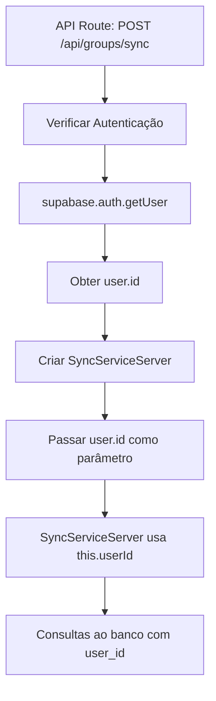

# Correção do Erro `getUser()` no SyncServiceServer

## Problema Identificado

O erro 500 na API de sincronização estava ocorrendo porque o `SyncServiceServer` estava tentando usar `this.supabase.auth.getUser()`, mas o `createClient()` do servidor não tem o método `auth.getUser()` da mesma forma que o cliente.

## Erro Específico

```
Resultado da sincronização: {
  success: false,
  error: "Cannot read properties of undefined (reading 'getUser')"
}
```

## Causa Raiz

### 1. **Diferença entre Cliente e Servidor**
```typescript
// ❌ Problema: Tentativa de usar auth.getUser() no servidor
// src/lib/sync/sync-service-server.ts
const { data: { user } } = await this.supabase.auth.getUser()
if (!user) throw new Error('Usuário não autenticado')
```

### 2. **Supabase Client vs Server**
```typescript
// Cliente (navegador)
import { createClient } from '@/lib/supabase/client'
const supabase = createClient()
const { data: { user } } = await supabase.auth.getUser() // ✅ Funciona

// Servidor (API routes)
import { createClient } from '@/lib/supabase/server'
const supabase = createClient()
const { data: { user } } = await supabase.auth.getUser() // ❌ Não funciona da mesma forma
```

### 3. **Arquitetura do SyncServiceServer**
```typescript
// ❌ Problema: SyncServiceServer tentando obter usuário internamente
export class SyncServiceServer {
  constructor(zApiClient: ZApiClient) {
    this.zApiClient = zApiClient
    this.supabase = createClient() // Servidor
  }

  async syncGroupsFromWhatsApp() {
    // ❌ Tentativa de usar auth.getUser() no servidor
    const { data: { user } } = await this.supabase.auth.getUser()
  }
}
```

## Solução Implementada

### 1. **Modificação do Construtor**

#### Antes (❌ Erro)
```typescript
// src/lib/sync/sync-service-server.ts
export class SyncServiceServer {
  private zApiClient: ZApiClient
  private supabase: any

  constructor(zApiClient: ZApiClient) {
    this.zApiClient = zApiClient
    this.supabase = createClient()
  }
}
```

#### Depois (✅ Correto)
```typescript
// src/lib/sync/sync-service-server.ts
export class SyncServiceServer {
  private zApiClient: ZApiClient
  private supabase: any
  private userId: string

  constructor(zApiClient: ZApiClient, userId: string) {
    this.zApiClient = zApiClient
    this.supabase = createClient()
    this.userId = userId // ✅ Recebe userId como parâmetro
  }
}
```

### 2. **Remoção de Chamadas `auth.getUser()`**

#### Antes (❌ Erro)
```typescript
// src/lib/sync/sync-service-server.ts
async syncGroupsFromWhatsApp() {
  // Obter grupos do banco de dados
  const { data: { user } } = await this.supabase.auth.getUser()
  if (!user) throw new Error('Usuário não autenticado')

  const { data: dbGroups } = await this.supabase
    .from('whatsapp_groups')
    .select('*')
    .eq('user_id', user.id)
}
```

#### Depois (✅ Correto)
```typescript
// src/lib/sync/sync-service-server.ts
async syncGroupsFromWhatsApp() {
  // Obter grupos do banco de dados
  const { data: dbGroups } = await this.supabase
    .from('whatsapp_groups')
    .select('*')
    .eq('user_id', this.userId) // ✅ Usa userId do construtor
}
```

### 3. **Atualização dos Métodos Auxiliares**

#### Método `createGroupInDatabase`
```typescript
// ❌ Antes
private async createGroupInDatabase(whatsappGroup: ZApiGroup, userId: string, options: SyncOptions) {
  // ...
  user_id: userId,
}

// ✅ Depois
private async createGroupInDatabase(whatsappGroup: ZApiGroup, options: SyncOptions) {
  // ...
  user_id: this.userId, // ✅ Usa userId da classe
}
```

#### Método `syncGroupParticipants`
```typescript
// ❌ Antes
async syncGroupParticipants(groupId: string, options: SyncOptions = {}) {
  const { data: { user } } = await this.supabase.auth.getUser()
  if (!user) throw new Error('Usuário não autenticado')

  const { data: group } = await this.supabase
    .from('whatsapp_groups')
    .select('*')
    .eq('id', groupId)
    .eq('user_id', user.id)
    .single()
}

// ✅ Depois
async syncGroupParticipants(groupId: string, options: SyncOptions = {}) {
  const { data: group } = await this.supabase
    .from('whatsapp_groups')
    .select('*')
    .eq('id', groupId)
    .eq('user_id', this.userId) // ✅ Usa userId da classe
    .single()
}
```

### 4. **Atualização das API Routes**

#### API de Sincronização de Grupos
```typescript
// src/app/api/groups/sync/route.ts
// ✅ Passar userId para SyncServiceServer
const syncService = new SyncServiceServer(zApiClient, user.id)
```

#### API de Sincronização de Grupo Específico
```typescript
// src/app/api/groups/[id]/sync/route.ts
// ✅ Passar userId para SyncServiceServer
const syncService = new SyncServiceServer(zApiClient, user.id)
```

## Arquitetura Corrigida

### Fluxo de Autenticação


### Separação de Responsabilidades
```typescript
// API Route (Servidor)
export async function POST(request: NextRequest) {
  // ✅ Responsabilidade: Autenticação
  const { data: { user } } = await supabase.auth.getUser()
  if (!user) return NextResponse.json({ error: 'Não autorizado' }, { status: 401 })

  // ✅ Responsabilidade: Passar userId para SyncService
  const syncService = new SyncServiceServer(zApiClient, user.id)
}

// SyncServiceServer (Servidor)
export class SyncServiceServer {
  constructor(zApiClient: ZApiClient, userId: string) {
    this.userId = userId // ✅ Recebe userId, não tenta obtê-lo
  }

  async syncGroupsFromWhatsApp() {
    // ✅ Responsabilidade: Sincronização usando userId
    const { data: dbGroups } = await this.supabase
      .from('whatsapp_groups')
      .select('*')
      .eq('user_id', this.userId)
  }
}
```

## Benefícios da Correção

### 1. **Separação de Responsabilidades**
- ✅ API Route: Gerencia autenticação
- ✅ SyncServiceServer: Gerencia sincronização
- ✅ Sem duplicação de lógica de autenticação

### 2. **Compatibilidade Servidor/Cliente**
- ✅ SyncServiceServer funciona no servidor
- ✅ SyncService continua funcionando no cliente
- ✅ Sem tentativas de usar métodos incompatíveis

### 3. **Performance**
- ✅ Sem chamadas desnecessárias de autenticação
- ✅ userId passado diretamente
- ✅ Menos overhead de rede

### 4. **Manutenibilidade**
- ✅ Código mais limpo e organizado
- ✅ Responsabilidades bem definidas
- ✅ Fácil de testar e debugar

## Como Testar

### Teste 1: Sincronização de Grupos
1. Acesse `/dashboard/groups`
2. Clique no botão "Sincronizar"
3. **Resultado esperado**: Sem erro 500, sincronização funcionando

### Teste 2: Verificar Logs
1. Abra o terminal do servidor
2. Execute a sincronização
3. **Resultado esperado**: Logs de sucesso, sem erros de `getUser()`

### Teste 3: API Direta
```bash
# Teste com autenticação válida
curl -X POST http://localhost:3000/api/groups/sync \
  -H "Content-Type: application/json" \
  -H "Authorization: Bearer your-token" \
  -d '{
    "instanceId": "valid-instance-id",
    "direction": "from_whatsapp"
  }'
```

## Arquivos Modificados

### Arquivos Atualizados
- `src/lib/sync/sync-service-server.ts` - Modificado construtor e métodos
- `src/app/api/groups/sync/route.ts` - Passar userId para SyncServiceServer
- `src/app/api/groups/[id]/sync/route.ts` - Passar userId para SyncServiceServer

## Resultado Esperado

- ✅ **Erro 500 eliminado**: API de sincronização funcionando
- ✅ **Autenticação correta**: Separação de responsabilidades
- ✅ **Performance melhorada**: Sem chamadas desnecessárias
- ✅ **Código mais limpo**: Arquitetura bem definida

## Próximos Passos

1. **Testar com instância Z-API real**
2. **Verificar sincronização completa**
3. **Implementar sincronização automática**
4. **Adicionar testes unitários**

A correção resolve o erro `getUser()` e estabelece uma arquitetura mais robusta e limpa! 🎉
