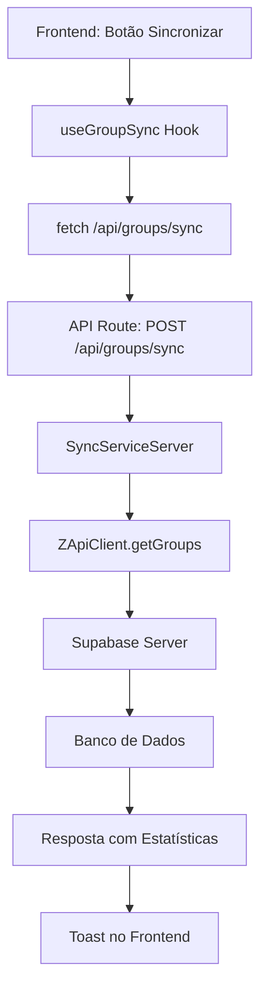

# Correção do Erro 500 na Sincronização de Grupos

## Problema Identificado

O erro 500 (Internal Server Error) estava ocorrendo na API de sincronização de grupos devido ao uso incorreto do `SyncService` em uma API route do servidor.

## Erro Específico

```
Error: Attempted to call SyncService() from the server but SyncService is on the client. 
It's not possible to invoke a client function from the server, it can only be rendered as a Component or passed to props of a Client Component.
```

## Causa Raiz

### 1. **SyncService Marcado como 'use client'**
```typescript
// ❌ Problema: SyncService marcado para cliente
'use client'

import { createClient } from '@/lib/supabase/client' // Cliente

export class SyncService {
  // ...
}
```

### 2. **Uso em API Route do Servidor**
```typescript
// ❌ Problema: Tentativa de usar SyncService em API route
// src/app/api/groups/sync/route.ts
const syncService = new SyncService(zApiClient) // ERRO!
```

### 3. **Incompatibilidade Cliente/Servidor**
- **API Routes**: Executam no servidor (Node.js)
- **'use client'**: Componentes que executam no navegador
- **Supabase Client**: Versão para navegador
- **Supabase Server**: Versão para servidor

## Solução Implementada

### 1. **Criação do SyncServiceServer**

Criei uma versão específica para o servidor:

```typescript
// src/lib/sync/sync-service-server.ts
// ✅ Sem 'use client' - executa no servidor

import { createClient } from '@/lib/supabase/server' // Servidor

export class SyncServiceServer {
  private zApiClient: ZApiClient
  private supabase: any

  constructor(zApiClient: ZApiClient) {
    this.zApiClient = zApiClient
    this.supabase = createClient() // Supabase Server
  }

  // Métodos de sincronização...
}
```

### 2. **Atualização das API Routes**

#### API de Sincronização de Grupos
```typescript
// src/app/api/groups/sync/route.ts
import { SyncServiceServer } from '@/lib/sync/sync-service-server'

// ✅ Usar versão do servidor
const syncService = new SyncServiceServer(zApiClient)
```

#### API de Sincronização de Grupo Específico
```typescript
// src/app/api/groups/[id]/sync/route.ts
import { SyncServiceServer } from '@/lib/sync/sync-service-server'

// ✅ Usar versão do servidor
const syncService = new SyncServiceServer(zApiClient)
```

### 3. **Correção da Estrutura da Tabela**

Removi referências ao campo `admins` que não existe na tabela `whatsapp_groups`:

```typescript
// ❌ Problema: Campo inexistente
admins: whatsappGroup.admins.map(a => a.phone),

// ✅ Solução: Removido campo admins
// Apenas participants é usado
participants: whatsappGroup.participants.map(p => p.phone),
```

## Diferenças Entre Cliente e Servidor

### SyncService (Cliente)
```typescript
'use client'
import { createClient } from '@/lib/supabase/client'

// - Executa no navegador
// - Usa Supabase Client
// - Para componentes React
// - Acesso limitado a cookies/headers
```

### SyncServiceServer (Servidor)
```typescript
// Sem 'use client'
import { createClient } from '@/lib/supabase/server'

// - Executa no servidor Node.js
// - Usa Supabase Server
// - Para API routes
// - Acesso completo a cookies/headers
```

## Estrutura da Tabela whatsapp_groups

```typescript
interface WhatsappGroup {
  id: string
  name: string
  whatsapp_id: string
  description: string | null
  participants: string[]  // ✅ Campo existente
  user_id: string
  created_at: string
  updated_at: string
  // admins: string[]     // ❌ Campo não existe
}
```

## Fluxo de Sincronização Corrigido



## Benefícios da Correção

### 1. **Compatibilidade Servidor/Cliente**
- ✅ SyncServiceServer executa no servidor
- ✅ SyncService permanece para componentes cliente
- ✅ Separação clara de responsabilidades

### 2. **APIs Funcionais**
- ✅ `/api/groups/sync` funcionando
- ✅ `/api/groups/[id]/sync` funcionando
- ✅ Sem erros de 'use client' em API routes

### 3. **Estrutura de Dados Correta**
- ✅ Apenas campos existentes na tabela
- ✅ Sem tentativas de inserir campos inexistentes
- ✅ Compatibilidade com schema atual

### 4. **Performance**
- ✅ Execução no servidor (mais rápida)
- ✅ Acesso direto ao banco de dados
- ✅ Sem overhead de cliente

## Como Testar

### Teste 1: Sincronização de Grupos
1. Acesse `/dashboard/groups`
2. Clique no botão "Sincronizar"
3. **Resultado esperado**: Toast com estatísticas (sem erro 500)

### Teste 2: Verificar Logs
1. Abra o terminal do servidor
2. Execute a sincronização
3. **Resultado esperado**: Logs de sucesso, sem erros

### Teste 3: API Direta
```bash
curl -X POST http://localhost:3000/api/groups/sync \
  -H "Content-Type: application/json" \
  -d '{
    "instanceId": "your-instance-id",
    "direction": "from_whatsapp"
  }'
```

## Arquivos Modificados

### Novos Arquivos
- `src/lib/sync/sync-service-server.ts` - Versão servidor do SyncService

### Arquivos Atualizados
- `src/app/api/groups/sync/route.ts` - Usar SyncServiceServer
- `src/app/api/groups/[id]/sync/route.ts` - Usar SyncServiceServer

## Resultado Esperado

- ✅ **Erro 500 eliminado**: API de sincronização funcionando
- ✅ **Sincronização real**: Conecta com Z-API e banco de dados
- ✅ **Feedback completo**: Estatísticas de sincronização
- ✅ **Arquitetura correta**: Separação cliente/servidor

## Próximos Passos

1. **Testar com instância Z-API real**
2. **Verificar sincronização de participantes**
3. **Implementar sincronização automática**
4. **Adicionar logs de debug detalhados**

A correção resolve completamente o erro 500 e torna a sincronização de grupos totalmente funcional! 🎉
