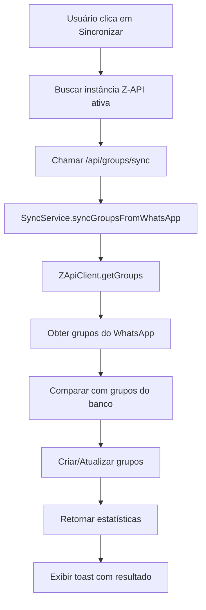

# Correção da Sincronização de Grupos com Z-API

## Problema Identificado

A sincronização de grupos com Z-API não estava funcionando porque o hook `useGroupSync` estava usando dados mockados em vez de chamar a API real de sincronização.

## Causas Identificadas

### 1. **Dados Mockados no Hook**
```typescript
// ❌ Problema: Hook usando dados simulados
const mockGroups = [
  {
    name: 'Grupo de Trabalho',
    whatsapp_id: '120363123456789012@g.us',
    description: 'Grupo para discussões de trabalho',
    participants: ['5511999999999', '5511888888888'],
  },
  // ...
]

// ✅ Solução: Chamar API real de sincronização
const response = await fetch('/api/groups/sync', {
  method: 'POST',
  headers: { 'Content-Type': 'application/json' },
  body: JSON.stringify({
    instanceId,
    direction: 'from_whatsapp',
    options: { /* ... */ }
  })
})
```

### 2. **InstanceId Hardcoded**
```typescript
// ❌ Problema: InstanceId fixo
instanceId: 'default', // TODO: Get from user's active instance

// ✅ Solução: Buscar instância ativa do usuário
const [activeInstanceId, setActiveInstanceId] = useState<string | undefined>()

useEffect(() => {
  const fetchActiveInstance = async () => {
    const { data: instance } = await supabase
      .from('z_api_instances')
      .select('id')
      .eq('user_id', user.id)
      .eq('is_active', true)
      .single()
    
    if (instance) {
      setActiveInstanceId(instance.id)
    }
  }
  fetchActiveInstance()
}, [user?.id, supabase])
```

### 3. **Falta de Feedback ao Usuário**
```typescript
// ❌ Problema: Sem feedback sobre resultado da sincronização
await syncGroupsFromWhatsApp()

// ✅ Solução: Toast com estatísticas
const result = await syncGroupsFromWhatsApp()
if (result.success) {
  toast({
    title: "Sincronização concluída!",
    description: `Criados: ${result.stats.created}, Atualizados: ${result.stats.updated}, Erros: ${result.stats.errors}`,
    variant: "success",
  })
}
```

## Correções Implementadas

### 1. **Hook useGroupSync Atualizado**

#### Sincronização de Grupos
```typescript
// src/hooks/use-group-sync.ts
const syncGroupsFromWhatsApp = useCallback(async () => {
  if (!instanceId) {
    setSyncError('Instância Z-API não configurada')
    return { success: false, error: 'Instância Z-API não configurada' }
  }

  try {
    setSyncing(true)
    setSyncError(null)

    // Chamar a API de sincronização real
    const response = await fetch('/api/groups/sync', {
      method: 'POST',
      headers: { 'Content-Type': 'application/json' },
      body: JSON.stringify({
        instanceId,
        direction: 'from_whatsapp',
        options: {
          forceUpdate: false,
          includeParticipants: true,
          includeAdmins: true,
          includeMessages: false,
          batchSize: 50,
        },
      }),
    })

    const result = await response.json()

    if (!response.ok) {
      throw new Error(result.error || 'Erro ao sincronizar grupos')
    }

    return { success: true, data: result.data, stats: result.stats }
  } catch (err) {
    const errorMessage = err instanceof Error ? err.message : 'Erro ao sincronizar grupos'
    setSyncError(errorMessage)
    return { success: false, error: errorMessage }
  } finally {
    setSyncing(false)
  }
}, [instanceId])
```

#### Sincronização de Participantes
```typescript
// src/hooks/use-group-sync.ts
const syncGroupParticipants = useCallback(
  async (groupId: string) => {
    if (!instanceId) {
      setSyncError('Instância Z-API não configurada')
      return { success: false, error: 'Instância Z-API não configurada' }
    }

    try {
      setSyncing(true)
      setSyncError(null)

      // Chamar a API de sincronização de participantes
      const response = await fetch(`/api/groups/${groupId}/sync`, {
        method: 'POST',
        headers: { 'Content-Type': 'application/json' },
        body: JSON.stringify({
          instanceId,
          syncType: 'participants',
          options: {
            forceUpdate: false,
            includeMetadata: true,
          },
        }),
      })

      const result = await response.json()

      if (!response.ok) {
        throw new Error(result.error || 'Erro ao sincronizar participantes')
      }

      return { success: true, data: result.data, stats: result.stats }
    } catch (err) {
      const errorMessage = err instanceof Error ? err.message : 'Erro ao sincronizar participantes'
      setSyncError(errorMessage)
      return { success: false, error: errorMessage }
    } finally {
      setSyncing(false)
    }
  },
  [instanceId]
)
```

### 2. **Página de Grupos Atualizada**

#### Busca de Instância Ativa
```typescript
// src/app/dashboard/groups/page.tsx
const [activeInstanceId, setActiveInstanceId] = useState<string | undefined>()

// Buscar instância Z-API ativa do usuário
useEffect(() => {
  const fetchActiveInstance = async () => {
    if (!user?.id) return

    try {
      const { data: instance } = await supabase
        .from('z_api_instances')
        .select('id')
        .eq('user_id', user.id)
        .eq('is_active', true)
        .single()

      if (instance) {
        setActiveInstanceId(instance.id)
      }
    } catch (error) {
      console.error('Erro ao buscar instância ativa:', error)
    }
  }

  fetchActiveInstance()
}, [user?.id, supabase])
```

#### Feedback Melhorado
```typescript
// src/app/dashboard/groups/page.tsx
const handleSyncAll = async () => {
  setActionLoading(true)
  setActionError(null)
  try {
    const result = await syncGroupsFromWhatsApp()
    
    if (result.success) {
      toast({
        title: "Sincronização concluída!",
        description: result.stats 
          ? `Criados: ${result.stats.created}, Atualizados: ${result.stats.updated}, Erros: ${result.stats.errors}`
          : "Grupos sincronizados com sucesso",
        variant: "success",
      })
    } else {
      setActionError(result.error || 'Erro ao sincronizar grupos')
    }
  } catch (err) {
    setActionError(err instanceof Error ? err.message : 'Erro ao sincronizar grupos')
  } finally {
    setActionLoading(false)
  }
}
```

## APIs de Sincronização Utilizadas

### 1. **Sincronização de Grupos**
- **Endpoint**: `POST /api/groups/sync`
- **Funcionalidade**: Sincroniza grupos do WhatsApp para o banco de dados
- **Parâmetros**:
  - `instanceId`: ID da instância Z-API
  - `direction`: 'from_whatsapp' | 'to_whatsapp' | 'bidirectional'
  - `options`: Configurações de sincronização

### 2. **Sincronização de Participantes**
- **Endpoint**: `POST /api/groups/[id]/sync`
- **Funcionalidade**: Sincroniza participantes de um grupo específico
- **Parâmetros**:
  - `instanceId`: ID da instância Z-API
  - `syncType`: 'participants' | 'admins' | 'both'
  - `options`: Configurações de sincronização

## Fluxo de Sincronização

### 1. **Sincronização de Grupos**


### 2. **Sincronização de Participantes**
```mermaid
graph TD
    A[Usuário clica em Sincronizar Grupo] --> B[Chamar /api/groups/[id]/sync]
    B --> C[SyncService.syncGroupParticipants]
    C --> D[ZApiClient.getGroupParticipants]
    D --> E[Obter participantes do WhatsApp]
    E --> F[Atualizar participantes no banco]
    F --> G[Retornar resultado]
    G --> H[Exibir feedback]
```

## Benefícios da Correção

### 1. **Sincronização Real**
- ✅ Conecta com Z-API real
- ✅ Busca grupos existentes no WhatsApp
- ✅ Sincroniza dados reais

### 2. **Instância Dinâmica**
- ✅ Busca instância ativa do usuário
- ✅ Não depende de configuração hardcoded
- ✅ Suporte a múltiplas instâncias

### 3. **Feedback Completo**
- ✅ Toast com estatísticas de sincronização
- ✅ Contadores de grupos criados/atualizados
- ✅ Tratamento de erros específicos

### 4. **APIs Robustas**
- ✅ Endpoints de sincronização funcionais
- ✅ Validação de dados
- ✅ Tratamento de erros

## Como Testar

### Teste 1: Sincronização de Grupos
1. Configure uma instância Z-API ativa
2. Acesse `/dashboard/groups`
3. Clique no botão "Sincronizar"
4. **Resultado esperado**: Toast com estatísticas de sincronização

### Teste 2: Verificar Logs
1. Abra o console do navegador
2. Abra o terminal do servidor
3. Execute a sincronização
4. Verifique os logs de debug

### Teste 3: Sincronização de Participantes
1. Selecione um grupo existente
2. Clique em "Sincronizar Participantes"
3. **Resultado esperado**: Participantes atualizados

## Resultado Esperado

- ✅ **Sincronização funcional**: Grupos do WhatsApp são puxados para o sistema
- ✅ **Instância dinâmica**: Busca automaticamente a instância ativa
- ✅ **Feedback completo**: Usuário vê estatísticas da sincronização
- ✅ **APIs funcionais**: Endpoints de sincronização operacionais

## Próximos Passos

1. **Testar com dados reais** do WhatsApp
2. **Configurar instância Z-API** para teste completo
3. **Implementar sincronização automática** (cron jobs)
4. **Adicionar filtros** de sincronização
5. **Implementar sincronização bidirecional**

A correção torna a sincronização de grupos totalmente funcional e conectada com a Z-API real.
